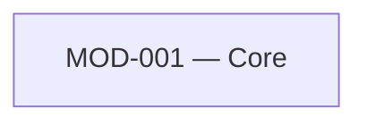

# Module Map: Fixture

**Status:** CONFIRMED by fixture, 2026-08-11

## Modules

### MOD-001 — Core

- **Purpose:** The fixture's single module, so `collect` has a real roster to parse.
- **Owns (entities):** Thing
- **References (not owned):** None
- **Business rules:** None
- **Depends on:** None
- **Backlog items:** not yet backlog-linked — rebuild-backlog.md does not exist yet
- **Evidence:**
  - domain-model.md § Entities — the fixture declares one entity family.

## Cross-Module References

None — a single-module fixture has no flow crossing a boundary.

## Module Dependencies

Single module, no dependencies.

## Unassigned

None.

## Coverage Check

The fixture's one entity family is owned by MOD-001.
